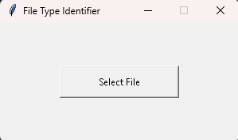
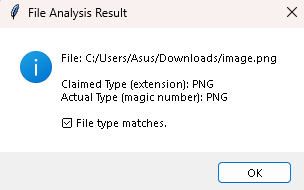

# File-Type-Identifier-Using-Magic-Numbers
A cross-platform file analysis and security tool that identifies the true file type by inspecting file headers (magic numbers), rather than trusting file extensions.  
This project helps detect disguised or malicious files commonly used in malware delivery, phishing attacks, and social engineering.

# 🔍 File Type Identifier Using Magic Numbers

## 📄 Documentation

File extensions can be easily spoofed or manipulated, which creates serious security risks in cybersecurity, malware analysis, and digital forensics.  
This project solves that problem by identifying a file’s **real type using magic numbers (binary file signatures)** instead of relying on the extension.

The tool reads the **file header (initial bytes)** and compares it against a database of known magic numbers to:
- Identify the actual file format
- Detect mismatched or spoofed extensions
- Flag potentially malicious or disguised files

This approach is commonly used in **penetration testing, secure file uploads, incident response, and CTF challenges**.

---

## ⚙️ How It Works

1. The user selects a file (via file picker or terminal input)
2. The program reads the first few bytes of the file
3. These bytes are converted to hexadecimal format
4. The hex signature is compared against a magic number database
5. The tool:
   - Determines the real file type
   - Compares it with the file extension
   - Warns if a mismatch is detected
  
You can download the folders based on your preference GUI or CLI based.

### Logical Flow
Select File → Read Header → Match Magic Number → Identify Type → Validate Extension
---

## 🛠️ Technologies Used

- **Python**
  - Binary file handling
  - Header parsing
- **Magic Number Database**
  - PNG, JPG, PDF, ZIP, EXE, ELF, MP3, MP4, etc.
- **Tkinter (optional)**
  - Graphical file selection panel
- **Linux Terminal**
  - ANSI colors and animations
- **PyInstaller**
  - Convert the script into a Windows `.exe`

---

## 💼 Business Value

### 🔐 Cybersecurity
- Detects files disguised as safe formats
- Prevents execution of hidden payloads
- Helps during penetration testing and CTFs

### 🧪 Digital Forensics
- Verifies file integrity
- Identifies tampered or corrupted files
- Assists in malware investigations

### 🏢 Enterprise Security
- Improves file upload validation
- Reduces risk of web shell uploads
- Adds an extra layer of defense

### 📈 Key Benefits
- Lightweight and fast
- Extension-independent
- Cross-platform (Linux & Windows)

---

## 🖼️ Screenshots / Demo

This is the select file GUI for windows.

Result of the scanning

This is how it looks in the linux CLI

Suggested examples:
- File selection dialog
- Terminal output showing detected file type
- Warning message for mismatched extension

Example output:
